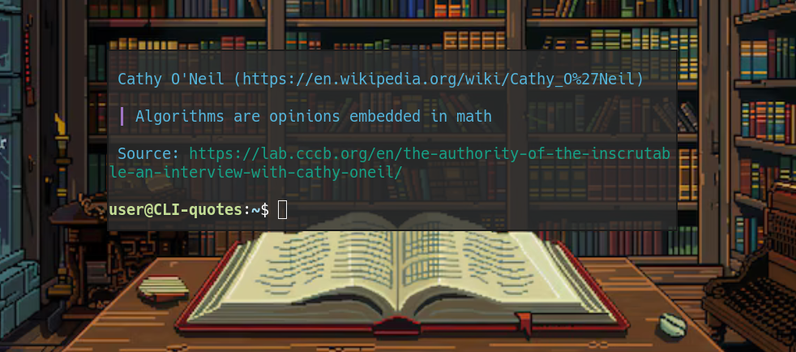

# CLI-quotes 



A simple app to create quotes collection and show them in your cli.

Built from [bret-victor-quotes](https://github.com/pouyakary/bret-victor-quotes) script.

## Using the CLI app

The CLI app can be built on UNIX via running `build-cli.sh`. 

First, install the requirements.
```bash
sudo apt install golang-go
```

Parameters can be used to select specific files and `-l LANG_CODE` to select language. So, for example:
```bash
build-cli.sh -l es quotes
```
Will build the spanish database stored in `quotes-data/es/quotes.json`.

After building, the CLI app can be installed using `install-cli.sh`.

## Adding quotes

The dataset is stored (as json files) in `quotes-data/$LANG_CODE`. You can select 

To modify the dataset in the app, edit the corresponding file, then re-build and re-install.

An example quote:
```json
{
    "author":      "Jacob Burckhardt",
    "authorlink":  "https://en.wikipedia.org/wiki/Jacob_Burckhardt",
    "link":        "https://medium.com/on-health-science-sexuality-and-psychoanalysis/denial-of-complexity-116055bd0bd8",
    "quote":       "The essence of tyranny is the denial of complexity.\n\n",
    "source":      "Who knows?"
}
```
